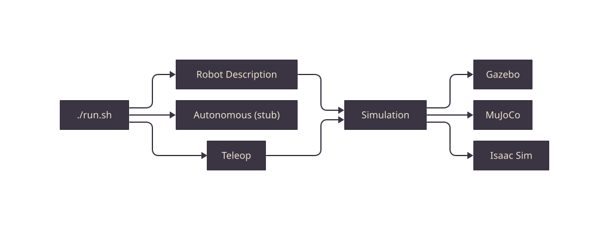
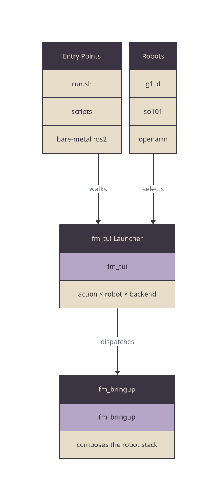

# fm-ros2

[](LICENSE)

First Motive's ROS2 workspace orchestrator.

The public stack lives in four per-package repos under the `first-motive` org. A
private learning overlay (data engine + policy) plugs in on top for team members
with access. This repo holds no package source — it assembles those repos into
one colcon workspace via `vcs`, and carries the shared tooling (Docker, dev
container, CI, scripts) and the full-system docs.

## Quick Start

Provision, then launch from your terminal. The package repos are
private, so this needs git access to the `first-motive` org — see
[docs/RUN.md](docs/RUN.md) for details.

**Install** (setup only — clone + import + viewer):

```bash
curl -fsSL https://raw.githubusercontent.com/first-motive/fm-ros2/main/install.sh | bash
```

**Run** (build the workspace + open the launcher):

```bash
cd fm_ros2 && ./run.sh
```

**New here?** Run the whole data path once — sim stack, record an episode,
process it, check the result — on a laptop with no hardware, in under an hour:
[docs/ONBOARDING.md](docs/ONBOARDING.md).

`install.sh` is setup only (clone + import + env + viewer); `run.sh` builds the
workspace and opens the launcher. They are split because `run.sh` drives an
interactive menu that a curl pipe cannot supply a terminal for, while `install.sh`
is non-interactive and safe to pipe.

Prefer a GUI? **First Motive** — a native macOS app at
[first-motive/fm-desktop](https://github.com/first-motive/fm-desktop) — is a third
front door beside the two above. It installs, runs, and observes the same stack
through the same script contract, sharing the `~/fm_ros2` workspace and the
`.fm_ros2.json` / `.fm_tui.json` profiles, so the app and the terminal stay in
sync. It is operator-first; the terminal paths remain the reference for dev and CI.

```bash
./run.sh --desktop          # launch First Motive (install it first — macOS)
```

`run.sh --desktop` launches the installed app; it does not build or install. Install
First Motive first: `./install.sh` puts it in `/Applications` for team members,
or use the fm-desktop repo's own `install.sh` directly. See
[docs/RUN.md](docs/RUN.md#desktop-front-door) for the install/run split.

`install.sh` picks a run path by OS: macOS and Windows default to **native**
(ROS2 Humble via pixi + RoboStack, no container), Linux defaults to the
**container** (Docker + compose, also the CI/parity path). Override the path and
viewer with flags; the choice is written to `.fm_ros2.json`, and `run.sh` reads it
to dispatch.

On **macOS the native path is self-contained** — the one-liner brings up the full
stack, including the MuJoCo sim, with no Docker. `import-externals.sh` vendors and
patches `mujoco_ros2_control` for macOS (RoboStack ships no build), the pixi env
carries the hand-tracking deps (mediapipe, trimesh, pycollada), and `pixi run
build` heals the ros2_control + MuJoCo dylibs and links the workspace message
typesupport so custom-message C++ nodes load. A fresh MacBook needs only the
one-liner and `./run.sh`.

```bash
curl ... | bash -s -- --native --viewer foxglove   # pixi/RoboStack, Foxglove
curl ... | bash -s -- --container                  # Docker + compose
```

| Flag | Effect |
|------|--------|
| `--native` | native ROS2 via pixi + RoboStack (default: macOS/Windows) |
| `--container` | Docker + compose (default: Linux; CI/parity elsewhere) |
| `--viewer foxglove\|rviz\|none` | viewer to install (default: foxglove) |

The private learning overlay imports automatically for team members: when the
installer's org-auth gate passes, its team-setup step provisions the overlay on
top of the public workspace. No flag needed. Opt out with `--no-learning`; force
it with `--learning` (which fails loud without org access):

```bash
curl ... | bash -s -- --no-learning   # skip the overlay
```

### Role One-Liners

One command per machine role — the desktop app on a Mac, and the two Linux
appliance roles the same installer provisions:

**Desktop app (macOS)** — pulls the latest release dmg into `/Applications`.
The app repo is private, so the script is fetched over an authenticated `gh`:

```bash
gh api repos/first-motive/fm-desktop/contents/install.sh --jq .content \
  | base64 --decode | bash
```

**Recorder (Linux camera host)** — RealSense + hand tracker + tactile glove +
episode recorder, streaming to the app over the LAN. Ubuntu 22.04 required; a
fresh host (a Jetson just flashed with Canonical's Ubuntu 22.04 tegra image)
gets ROS 2 Humble installed automatically, any other distro must bring its
own. `--service` makes it a boot
appliance (`fm-recorder.service` plus `fm-tactile.service` for the glove).
Bringing up a brand-new Jetson? Follow [docs/JETSON.md](docs/JETSON.md)
end-to-end. The one-liner clones into the directory it runs from, so `cd` to
the one that should own the checkout first:

```bash
mkdir -p ~/jetson && cd ~/jetson
curl -fsSL https://raw.githubusercontent.com/first-motive/fm-ros2/main/install.sh \
  | bash -s -- --recorder --service
```

When Axol already owns `:8765`, persist the First Motive bridge on `:8766` and
install its standalone owner during the same recorder setup:

```bash
cd ~/jetson/fm_ros2
FM_BRIDGE_PORT=8766 FM_INSTALL_FOXGLOVE_SERVICE=1 \
  ./install.sh --recorder --service
```

The tactile glove is a USB-tethered ESP32 reading five FSRs, published on
`/glove_left/tactile` at 40 Hz and recorded into every episode. Its ESP32 must
stay in one physical USB port: the CH340 adapter reports no serial number, so
the stable `/dev/fm-tactile-left` name is pinned to the port. The installer
detects the port from the plugged-in board (set `FM_TACTILE_USB_PORT` to name
it explicitly); with no board plugged it writes a vendor-only rule and the pin
is added by re-running `install-tactile-service.sh` once the glove sits in its
permanent port. The installer also masks `brltty-udev.service`, which
otherwise claims the adapter as a Braille display before the receiver can open
it.

**Data processor (Linux)** — the dataset engine, the annotation tooling
(`annotation_run` / `annotation_verify`), the isolated Python 3.12 release
runtime (LeRobot v3, Rerun, Dataset Release Pack v2, and `hf`), and the supervisor the desktop
app's Process surface drives (`/process/*`). Deliberately its own workspace,
separate from a recorder checkout: the recorder later moves to its own device
while processing stays on the strong host. On Ubuntu 22.04 it runs natively; on
any other Linux host with docker (the fm-setup workstation) it runs inside the
Humble container, with the same units on the host execing into it. `--service`
installs `fm-processor.service`:

```bash
mkdir -p ~/processor && cd ~/processor
curl -fsSL https://raw.githubusercontent.com/first-motive/fm-ros2/main/install.sh \
  | bash -s -- --processor --service
```

On a provisioned workstation, processor evidence and derived artifacts use the
workspace's shared `data/` root. The installer creates the bag-processing and RLDS runtime
plus a separate release runtime because their NumPy contracts differ. It wires
candidate export, Pack v2 build and verification, LeRobot conversion, Rerun,
and the `hf` CLI into the processor service. Hugging Face authentication and
the approved private `owner/name` destination remain operator actions; the
installer does not request or store a token.

All three need access to the private `first-motive` org: the Linux roles clone
private repos over git auth, and the app installer fetches its release through
`gh`.

`--service` also makes the box discoverable: the installer writes an avahi
advert (`_fm-rig._tcp`, role-tagged) so the desktop app's Settings lists the rig
by hostname — no typed IPs. Every box provisioned with a role one-liner shows up
on its own; both roles on one box advertise as two entries at the same address.
The advert also carries the box's release (`ver`/`data`/`teleop` TXT records),
which Settings shows on each discovered rig — the at-a-glance check that a
fleet update actually landed.

`--service` also puts the box on the release channel: the install pins the
workspace and role repos to their newest `v*` tag, and `fm-update-<role>.timer`
fetches tags every ~15 minutes, moving only when a newer release tag exists —
cutting a release rolls the fleet within one tick, while merged-but-untagged
main never moves a box. A take or processing run in flight is never
interrupted. Pause with `sudo systemctl stop fm-update-<role>.timer`. Because
those ticks run unattended, `--service` also grants the installing user
passwordless sudo (`/etc/sudoers.d/010-fm-appliance`); set `FM_NO_SUDOERS=1`
to opt out — updates then need a manual re-run of the role installer.

The processor can also carry the REAL annotation models: pinned Qwen2.5-VL-7B
remains the product baseline and rollback, while pinned Qwen3.5-9B is a
qualified, operator-selectable challenger. Each uses a descriptor-bound Python
3.11/CUDA runtime (NVIDIA hosts only);
provisioning is opt-in because the default fake-adapter lane needs none of it.
Provision the baseline view with
`FM_INSTALL_QWEN=1` on the one-liner, later via
`./scripts/install/setup-qwen.sh`, or from the desktop app's Process window.
Use `./scripts/install/setup-qwen.sh --model qwen3.5-9b` for the challenger.
The setup script verifies the exact model revision
and canonical file-inventory digest before promoting either view.
Model execution itself stays approval-gated per run; provisioning only
downloads and verifies content identities. The processor service retains each
real-model attempt, including failed and GPU-blocked runs, under
`<workspace>/data/annotations/runs/attempts`; override that durable root with
`FM_PROCESSOR_ANNOTATION_ATTEMPTS_DIR` in `/etc/fm-processor.env`.
Human review receipts, corrected outputs, and learning records persist beside
it under `data/annotations/runs/{reviews,corrections,learning}`. Their
`FM_PROCESSOR_ANNOTATION_*_DIR` settings are kept in the same environment file,
so processor restarts and updater re-installs retain the full review lineage.
Adjudications, revocations, frozen learning snapshots, and reproducible
improvement-run receipts persist in sibling
`{adjudications,revocations,learning-snapshots,improvement-runs}`
roots. The processor exposes only bounded read-only governance facts to
Desktop; the private data engine remains the writer and verifier authority.
The same supervisor serves exact review frames through the bounded
`/process/review_media/{select,meta,image}` contract. Requests identify an
episode, immutable annotation-bundle digest, and indexed frame or short range;
the processor verifies the bundle, source recording, media index, and returned
image digest. It never accepts a filesystem path or exposes a live camera
subscription to the review window.

The processor additionally gets `fm-sync.timer`, the recordings transfer for a
two-box split: it pulls finalized episodes from the recorder host into
`~/recordings` (index-driven, busy-gated, never deletes at the source). On a
single-box setup it idles as a quiet no-op; when the recorder moves to its own
device, set `FM_SYNC_SOURCE=user@<recorder>:~/recordings` in `/etc/fm-sync.env`
and the split is live on the next tick.

The processor build also includes `fm_data_archive`. With `--service`, it gets
an independent `fm-archive.service` for the Desktop archive surface. The
service is disabled in `/etc/fm-archive.env` until an operator installs a
read-only B2 application key. Local staging is a second, default-off setting in
that file. Restart `fm-archive.service` after enabling or changing the file.
The service passes only archive topics over the existing local DDS
and Foxglove boundary; Desktop never receives a credential, object key, or
local path. The browser keeps its catalogue on `/archive/index` and
`/archive/status`; the bounded `/archive/stage` request remains available for
read-side restore. The uploader publishes storage state separately on
`/archive/storage/index` and `/archive/storage/status`. Check the installed path
with:

```bash
bash scripts/service/archive-check.sh
```

The uploader is a separate, default-off `fm-archive-uploader.service`. It reads
only `/etc/fm-archive-uploader.env`, whose `BACKBLAZE_B2_FMREC_*` key is
write-scoped to the approved recording prefixes and must not have remote-delete
permission. The reader's `BACKBLAZE_B2_PROCARCH_*` key remains in
`/etc/fm-archive.env`; the two files are never inherited by one another. The
uploader allows one concurrent upload and requires 30 days of local
retention, and gives deletion eligibility a 15-minute window. Local deletion is
disabled in the first release. Its closed command topics are
`/archive/upload/retry`, `/archive/retention/verify`, and
`/archive/retention/delete` (the last is a confirmation request only, never a
remote delete). On a container-runtime processor, both services require the
already-running `fm-processor` container and cannot recreate or stop it.

Use the person-run archive workflow for status, checks, recovery, or an
idempotent install:

```bash
fm archive status
fm archive preflight --json
fm archive reconcile --dry-run
fm archive install --dry-run
```

The optional LeRobot source uses the same processor-owned service. Set
`FM_ARCHIVE_LEROBOT_CATALOGUE_FILE` in `/etc/fm-archive.env` to a closed local
catalogue JSON when it is approved for use. The empty default publishes no
LeRobot episodes. `FM_ARCHIVE_LEROBOT_STAGE_ENABLED=false` is a separate
default-off gate; when enabled, staged imports use
`FM_ARCHIVE_LEROBOT_STAGE_DIR` (default
`<workspace>/data/staged/lerobot`). Desktop sends only a published episode
identity and request ID; it never supplies this path, a bucket prefix, or a
credential. The processor service reads the same canonical root through
`FM_PROCESSOR_LEROBOT_IMPORTS_DIR`; if either root is customized, set both to
the same directory before restarting `fm-archive.service` and
`fm-processor.service`.

<details>
<summary>Manual steps (fallback)</summary>

```bash
git clone https://github.com/first-motive/fm-ros2.git fm_ros2
cd fm_ros2
./install.sh                       # bootstrap vcs + import repos + externals + viewer
./run.sh                           # auto-detect overlay, open the launcher
```

Clone by hand, then run `install.sh` from the checkout — same setup the curl
pipe runs (vcs bootstrap, package + external import, env + viewer), without
piping to `bash`. Team members get the private overlay automatically (org auth);
use `--no-learning` to skip it, `--native` or `--container` to override the path.

```bash
./run.sh --native      # force the native path (pixi/RoboStack)
./run.sh --container    # force the container path (Docker + compose)
```

</details>



Source: [`docs/diagrams/menu.d2`](docs/diagrams/menu.d2).
`run.sh` builds the workspace on every invocation, so the first run needs no
separate build step:

```bash
./run.sh                # native: pixi run build, then the launcher
./run.sh --container    # container: compose build + up, then the launcher
```

The native path builds and launches on the host (rviz2 renders natively; Foxglove
Studio connects to the in-env bridge at `ws://localhost:8765`). The container path
builds inside the dev container — see [SETUP.md](docs/SETUP.md) for its compose
commands.

On a Linux recorder appliance, the bridge endpoint is persisted in
`/etc/fm-bridge.env` (`FM_BRIDGE_PORT=8765` by default). If Axol owns `:8765`,
install the standalone owner on another port; the installer disables the
recorder's embedded bridge and keeps the choice across updater runs:

```bash
./scripts/install/install-foxglove-service.sh --port 8766
```

The service and Avahi advert both read that file. Use
`scripts/internal/bridge-probe.py` to check the configured local listener.

[Setup](docs/SETUP.md) · [externals](docs/EXTERNALS.md) · [Foxglove](docs/FOXGLOVE.md)
· [all guides](docs/README.md). Per-package detail in each `<package>/README.md`.

## Architecture

`fm_description` feeds `fm_control`; control drives a backend-selectable hardware
interface; `fm_bringup` launches the graph. A private learning overlay (data
engine + policy) plugs in on top. Full diagrams: [docs/ARCHITECTURE.md](docs/ARCHITECTURE.md).



Entry points invoke `fm_bringup`, which composes the robot stack. Blocks marked
with a stacked edge (`fm_tui`, `fm_bringup`) expand in
[`fm-app`](https://github.com/first-motive/fm-app)'s diagrams; the robot layer
detail lives in [`fm-robot`](https://github.com/first-motive/fm-robot). The
orchestrator view is in [docs/ARCHITECTURE.md](docs/ARCHITECTURE.md). Source:
[`docs/diagrams/system.d2`](docs/diagrams/system.d2).

## Layout

This repo holds no package source — only the workspace metapackage, shared
tooling, and full-system docs. `vcs import < fm-ros2.repos` pulls the shared
container infra into `docker/` and the four public package repos into `src/`.

```
fm_ros2/                     local checkout dir (snake to match the packages; GitHub slug stays fm-ros2)
├── fm_ros2/                 workspace metapackage (depends on the 4 public group metas)
├── fm-ros2.repos            vcs manifest: the 4 public package repos -> src/
├── external.repos           vcs pins for vendored externals -> external/
├── pixi.toml / pixi.lock    native ROS2 env: RoboStack channel, 3 platforms
├── docker/                  base image + compose overlays
├── .devcontainer/           VS Code dev container
├── .github/workflows/       CI: Linux build/test + macOS native smoke
├── scripts/                 tooling by role: install/ run/ ci/ dev/
├── docs/                    full-system docs + diagrams
├── install.sh               provisioner: clone + import + env + viewer
└── run.sh                   front door: dispatch native or container
```

The four public package repos (each builds standalone, history preserved from the
split):

| Repo | Layer | Packages |
|------|-------|----------|
| [fm-robot](https://github.com/first-motive/fm-robot) | robot | `fm_description` · `fm_control` · `fm_sensors` |
| [fm-sim](https://github.com/first-motive/fm-sim) | simulation | `fm_sim_core` · `fm_sim_backends` · `fm_sim_models` |
| [fm-teleop](https://github.com/first-motive/fm-teleop) | teleop | `fm_teleop_core` · `device` · `leader` · `vr` · `vision` · `panel` |
| [fm-app](https://github.com/first-motive/fm-app) | application | `fm_bringup` · `fm_tui` |

A private learning overlay plugs in on top for team members with access — see
[Learning Stack](docs/ARCHITECTURE.md#learning-stack-private-overlay).

## Platforms

| Platform | Role |
|----------|------|
| Linux (GPU) | dev · build · sim · hardware |
| macOS M5 (OrbStack) | dev · build · sim · dataset |

macOS runs Humble natively via pixi + RoboStack (the container path stays available
for parity) — no GPU, no hardware; MuJoCo runs native. The full workspace builds
natively; driving real Unitree hardware still needs the container — see
[SETUP.md](docs/SETUP.md).

## Releasing

Rigs converge on release tags, never on `main`, so a merged change reaches no
machine until a tag carries it. The front door for cutting one is `fm release`,
which refuses to tag a commit CI is not green on and only then delegates to this
repo's script:

```bash
fm release --repo fm-ros2                            # is the next tag safe to cut?
fm release --repo fm-ros2 --cut -- --apply           # gate, then cut the patch bump
fm release --repo fm-ros2 --cut -- --minor --apply   # gate, then cut the minor bump
```

Calling the script directly skips that gate, which is why a hook blocks it and
points back at the verb. What the verb delegates to, from a workspace checkout
with every repo imported:

```bash
./scripts/dev/cut-release.sh                  # print the plan, change nothing
./scripts/dev/cut-release.sh --apply          # cut and push the patch bump
./scripts/dev/cut-release.sh --minor --apply  # cut and push the minor bump
```

A release is the whole set of repos the workspace assembles, not this one alone.
Cadence, the repos it discovers, and verifying convergence:
[RELEASE.md](docs/RELEASE.md).

## CI

[](https://github.com/first-motive/fm-ros2/actions/workflows/ci.yml)

Ten jobs per push and PR; each reproduces locally with the exact CI command
([docs/CI.md](docs/CI.md)).

| Job | Runner | Proves |
|-----|--------|--------|
| `drift` | `ubuntu-latest` | no rendered file was edited in place |
| `loop` | `ubuntu-latest` | the sim-first loop closes: stack up → record → process → a usable manifest |
| `selftest` | `ubuntu-latest` | `install.sh` + `run.sh` survive the piped curl path |
| `workflows` | `ubuntu-latest` | the workflows and composite action lint clean |
| `appliance` | `ubuntu-latest` | updater busy gate, bridge endpoint, recorder udev rules |
| `workspace` | `ubuntu-latest` | colcon build + test (`fm_*`) → four-robot headless smoke |
| `native` | `macos-latest` (arm64) | full pixi env + native build + launch runtime deps + host-native MuJoCo core |
| `windows` | `windows-latest` | native dispatch + `.ps1` wrappers delegate through Git Bash |
| `installer` | `ubuntu-latest` | `install.sh` clone + import path populates `src/` |
| `panel` | `ubuntu-latest` | Foxglove teleop panel type-checks and bundles |

## License & Ownership

Maintained by First Motive, a Ubundi subsidiary, under the `first-motive` org.
Licensed under Apache-2.0 — see [LICENSE](LICENSE) and [NOTICE](NOTICE).
