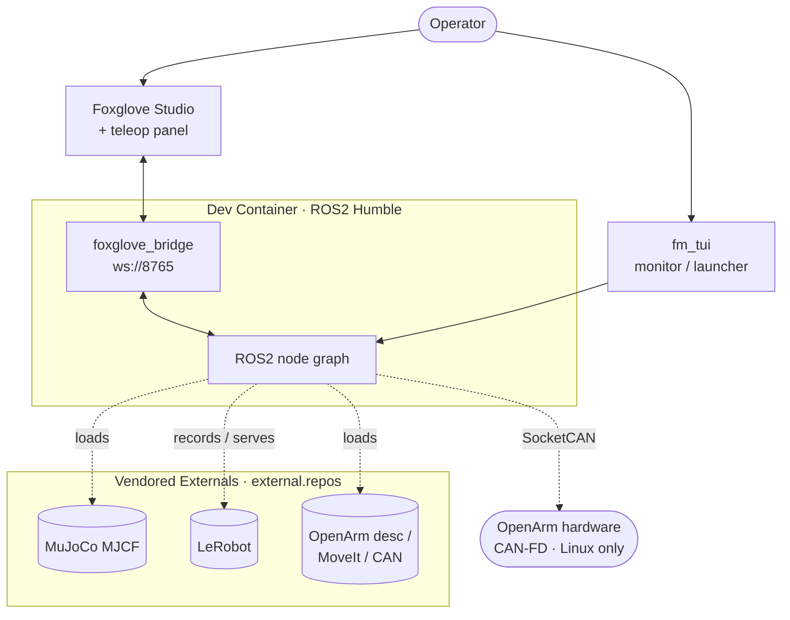
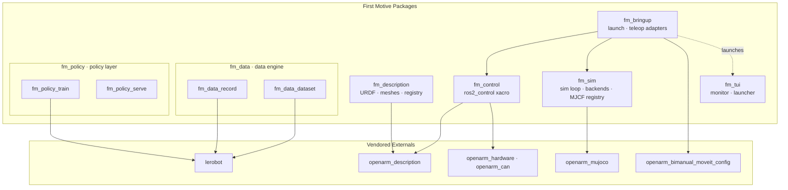
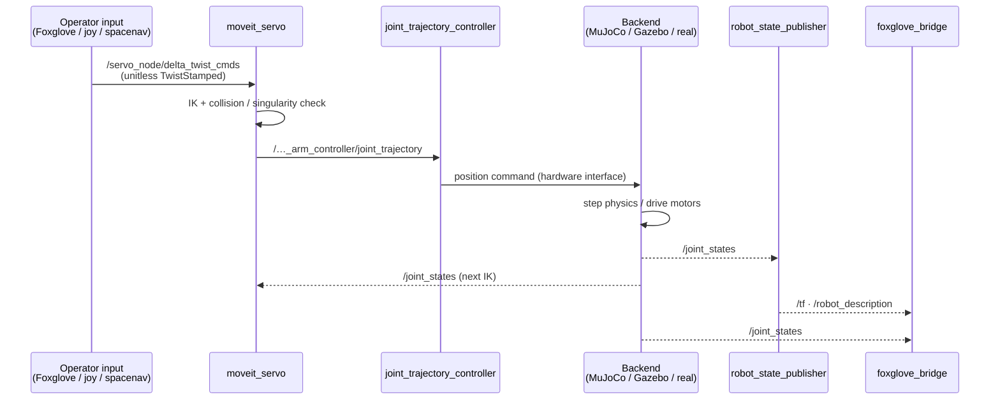
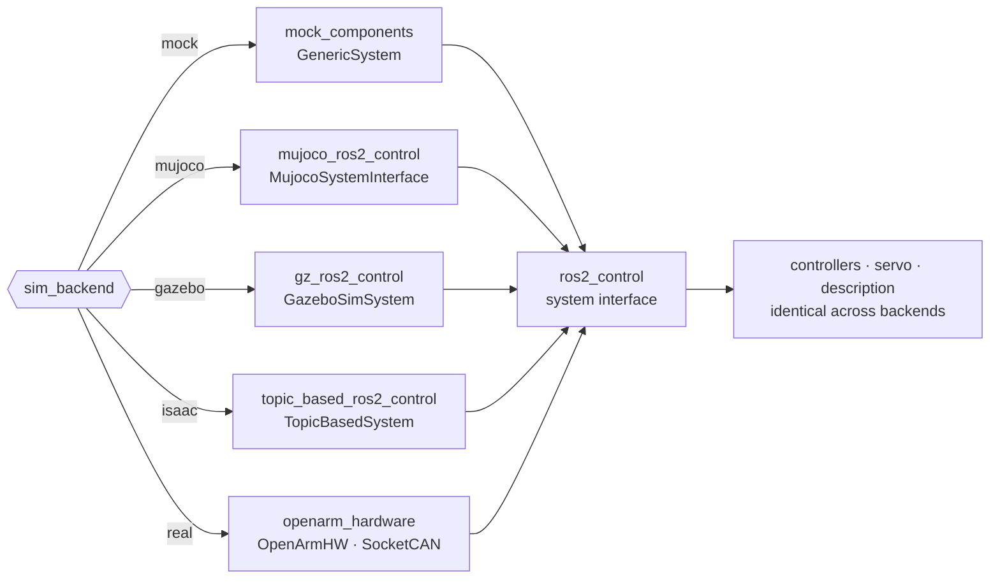
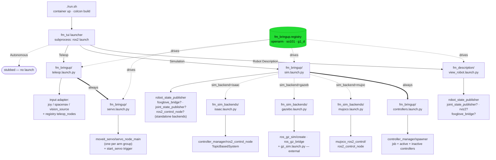
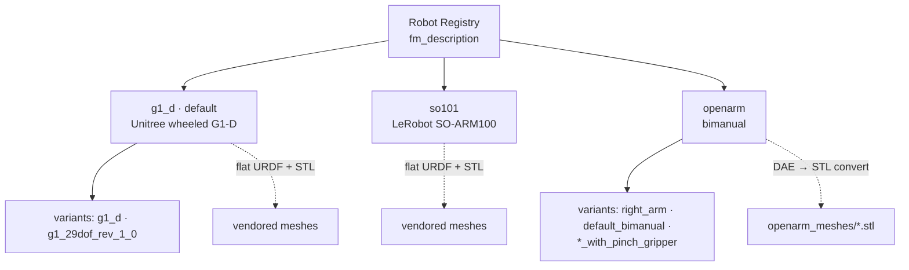
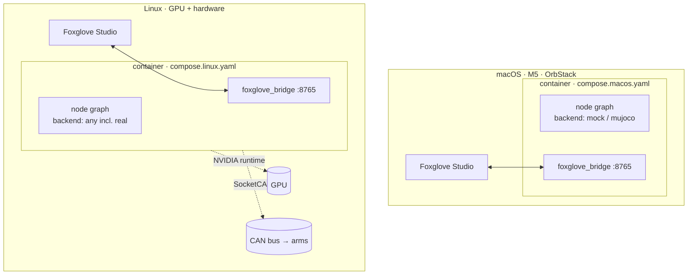
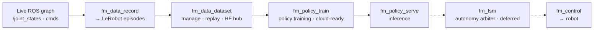

# Architecture

First Motive's ROS2 (Humble) workspace, designed as a layered robotics platform.
This document shows the structure: how the packages compose, how data flows at
runtime, and where the system boundaries sit.

The design follows a few systems-engineering principles, made explicit in
[Design Principles](#design-principles):

- **One interface, swappable implementations** — the same robot description and
  controller stack drive a mock, three simulators, or real hardware, selected by
  one argument.
- **Layered separation** — perception/policy, motion control, and hardware are
  distinct packages with one-directional dependencies. The autonomy arbiter that
  ties them together is deferred (`fm_fsm`).
- **Monorepo mirroring a polyrepo** — directory boundaries are the future
  repo boundaries, so growth is a `git filter-repo`, not a rewrite.

## System Context

The workspace runs inside a dev container. Operators drive it from a browser
(Foxglove) or a terminal (TUI). Physics and learning assets are vendored
externals. On Linux, the same stack reaches real OpenArm hardware over CAN.



| Actor / System | Role |
|----------------|------|
| Operator | Drives teleop, launches robots, watches the graph |
| Foxglove Studio | Browser viz + Cartesian/joint jog panel (`fm_teleop_panel`) |
| fm_tui | Terminal monitor (live graph) and menu launcher |
| Dev container | Hosts the entire ROS2 node graph; one per host |
| Vendored externals | MuJoCo models, LeRobot, OpenArm description/MoveIt/CAN |
| OpenArm hardware | Real bimanual arms over CAN-FD (Linux native only) |

## Component Architecture

First Motive packages sit on top of vendored externals. Dependencies point
one way: launch depends on the layers below it; the data engine and policy layer
never depend on launch.



| Package | Build | Responsibility |
|---------|-------|----------------|
| `fm_bringup` | ament_python | Launch files (sim/servo/teleop), controller configs, teleop input adapters |
| `fm_control` | ament_cmake | Backend-selectable `ros2_control` description (mock/mujoco/gazebo/isaac/real) |
| `fm_description` | ament_cmake | URDF/xacro, mesh handling, multi-robot registry (G1-D, SO101, OpenArm) |
| `fm_sim` | ament_cmake (meta) | Simulation: headless MuJoCo dev loop (`fm_sim_core`), backend hosts (`fm_sim_backends`), MJCF model registry (`fm_sim_models`) |
| `fm_data` | ament_cmake (meta) | Data engine: record → dataset (episode capture + curation) |
| `fm_policy` | ament_cmake (meta) | Policy layer: train → serve (model-agnostic learning + inference) |
| `fm_tui` | ament_python | Terminal monitor + menu launcher (Textual) |

The dependency direction is the design contract: **`fm_description` is the
foundation**, `fm_control` adds the control layer on top of it, and `fm_bringup`
orchestrates everything. The data engine (`fm_data`) and policy layer
(`fm_policy`) plug in at the top without the lower layers knowing they exist. The
autonomy arbiter that consumes policy output is deferred (`fm_fsm`).

## Runtime Data Flow

The core loop is teleop into a simulated or real arm. An operator jog command
becomes a Cartesian/joint delta, MoveIt Servo turns it into a trajectory, the
controller streams it to the active backend, and the backend publishes joint
state back — closing the loop at roughly 100 Hz.



Key topics:

| Topic | Type | From → To |
|-------|------|-----------|
| `/servo_node/delta_twist_cmds` | `geometry_msgs/TwistStamped` | teleop adapter → servo |
| `/servo_node/delta_joint_cmds` | `control_msgs/JointJog` | teleop adapter → servo |
| `/…_arm_controller/joint_trajectory` | `trajectory_msgs/JointTrajectory` | servo → JTC |
| `/joint_states` | `sensor_msgs/JointState` | backend → RSP, servo, viz, recorder |
| `/tf`, `/tf_static` | `geometry_msgs/TransformStamped` | RSP → servo, viz |
| `/robot_description` | URDF (XML) | RSP → servo, viz, gazebo |
| `/rosout` | `rcl_interfaces/Log` | all nodes → fm_tui monitor |

Teleop input is pluggable — `teleop.launch.py input:=foxglove|joy|spacenav` swaps
the adapter, but every adapter normalizes to the same `delta_twist_cmds` topic, so
nothing downstream changes.

## Hardware Abstraction Layer

This is the architectural crux. `fm_control` emits one `ros2_control` system
whose `<hardware>` plugin is chosen by the `sim_backend` argument. Everything
above the hardware interface — controllers, servo, description, teleop — is
identical across all backends.



| Backend | Plugin | Host | Use |
|---------|--------|------|-----|
| `mock` | `mock_components/GenericSystem` | any CPU | State echo, no physics — fast smoke tests |
| `mujoco` | `mujoco_ros2_control/MujocoSystemInterface` | CPU (arm64 ok) | **Daily driver**, incl. macOS M5 |
| `gazebo` | `gz_ros2_control/GazeboSimSystem` | Linux GPU | Higher-fidelity sim |
| `isaac` | `topic_based_ros2_control/TopicBasedSystem` | Linux GPU + external Isaac | Photoreal sim over ROS topics |
| `real` | `openarm_hardware/OpenArmHW` | Linux native | CAN-FD to DM motors |

The xacro layering that makes this work:

```
openarm.sim.urdf.xacro          (top level)
  ├─ openarm_description geometry + preset YAML   → links, joints, meshes
  └─ openarm.ros2_control.xacro                   → one <ros2_control> per arm
       └─ hardware block selected by sim_backend  → plugin above
```

Because the swap happens at the `<hardware>` boundary, switching from MuJoCo to
real hardware is a launch argument, not a code change.

## Launch Dependency Graph

The sections above show *package* dependencies. This section shows the *launch*
graph: which launch file includes which, what nodes each spawns, and what config
each loads at runtime. The root is `./run.sh`, and `fm_bringup.registry` resolves
everything robot-specific so the launch files themselves stay thin.

`run.sh` is the front door (see [run.md](run.md) for its container/build steps).
It ends by execing `ros2 run fm_tui fm_tui_launcher`. The launcher walks
action → robot → variant (→ backend), then shells out the matching `ros2 launch`
via `subprocess`. Three actions are wired; autonomous is a stub.



Edge meaning: solid bold (`==>`) is an unconditional include; dotted (`-.->`)
is conditional, labelled with the gating argument or predicate; plain (`-->`) is
a node spawn. `gz_sim.launch.py` is the only include that crosses into an external
package; everything else is first-party.

### Include + Spawn Table

| Launch file | Package | Includes | Spawns (— = conditional) |
|-------------|---------|----------|--------------------------|
| `view_robot.launch.py` | fm_description | — | robot_state_publisher; joint_state_publisher—; rviz2—; foxglove_bridge— |
| `sim.launch.py` | fm_bringup | `controllers.launch.py` (always); one `fm_sim_backends/*` by `sim_backend` | robot_state_publisher; foxglove_bridge—; joint_state_publisher—; ros2_control_node— |
| `controllers.launch.py` | fm_bringup | — | controller_manager/spawner; ros2_control_node— (`use_standalone_cm`) |
| `teleop.launch.py` | fm_bringup | `servo.launch.py` (always) | input adapter by `input`; registry `teleop_nodes` |
| `servo.launch.py` | fm_bringup | — | moveit_servo/servo_node_main (per arm) + start_servo trigger |
| `mujoco.launch.py` | fm_sim_backends | — | mujoco_ros2_control/ros2_control_node (`xvfb-run`) |
| `gazebo.launch.py` | fm_sim_backends | `gz_sim.launch.py` (external) | ros_gz_sim/create; ros_gz_bridge/parameter_bridge |
| `isaac.launch.py` | fm_sim_backends | — | controller_manager/ros2_control_node (TopicBasedSystem) |

### Config Files Loaded

| Launch file | Config | Package | Selected by |
|-------------|--------|---------|-------------|
| `sim.launch.py` | `config/<robot>/<variant>/controllers.yaml` | fm_bringup | `spec.controllers_file(variant)` |
| `servo.launch.py` | `config/<robot>/servo.yaml` (per arm) | fm_bringup | `spec.servo_nodes()` |
| `servo.launch.py` | `kinematics.yaml`, `joint_limits.yaml` | external `*_moveit_config` | `spec.moveit_file()` |
| `mujoco` / `isaac` backend | `robot_description` (xacro), `controllers_file` | fm_bringup | passed down from `sim.launch.py` |

`robot_description` is not a YAML file — it is built inline by
`spec.build_description(variant, sim_backend, controllers_file)`, which expands the
xacro, rewrites mesh paths, and injects the backend's `<hardware>` plugin (see
[Hardware Abstraction Layer](#hardware-abstraction-layer)). For the `mujoco`
backend it also injects the robot's MJCF path, looked up from `fm_sim_models` (the
path is no longer hardcoded in the xacro).

### Standalone Roots

Two launch files run outside the TUI path:

- `fm_bringup/bringup.launch.py` — runtime stack: `foxglove_bridge`,
  `fm_control/control_node`. No includes.
- `fm_sim_core/sim.launch.py` — headless control loop: a single
  `fm_sim_core/sim_loop` node, parameterised by `config/sim.yaml`. Note this
  is a *different* file from `fm_bringup/sim.launch.py` (the TUI's full sim stack);
  they share a name but neither includes the other.

The direct scripts (`scripts/sim.sh`, `scripts/teleop.sh`,
`scripts/view-robot.sh`) bypass the launcher and call the same `fm_bringup` /
`fm_description` launch files shown above.

## Robot Registry

`fm_description` carries a registry that abstracts over three robots. Each entry
defines its description source, variants, and mesh strategy. The viewer and
launchers select by `robot:=` and `variant:=`.



Mesh handling differs by source: G1-D and SO101 ship flat URDF + STL files
vendored into the package, while OpenArm visual `.dae` meshes are converted to
`.stl` at build time so the Foxglove bridge can fetch them over the `package://`
scheme.

## Deployment

One dev container hosts the full node graph. The host OS only provides Docker,
the browser, and (on Linux) the GPU and CAN bus. Compose overlays adapt the same
base image per platform.



| Platform | Role | Backends | Notes |
|----------|------|----------|-------|
| Linux (GPU) | Main system | mock, mujoco, gazebo, isaac, real | Full stack incl. hardware |
| macOS M5 (OrbStack) | Dev / build / sim / dataset | mock, mujoco | No GPU, no hardware; MuJoCo via native arm64 wheel |

The entry point is `./run.sh`, which detects the host, selects the compose
overlay, brings the container up, and opens the `fm_tui` launcher. The
`openarm_hardware` and `openarm_can` packages are `COLCON_IGNORE`'d on macOS,
since they need Linux SocketCAN.

## Data Engine + Policy Layer

The learning loop spans two metapackages. `fm_data` is the data engine: record
teleop episodes, manage datasets. `fm_policy` is the policy layer: train policies,
serve inference to the autonomy arbiter — model-agnostic. Each group is split-ready,
so it can move to its own repo (or the cloud) independently. The runtime wiring is
still being built out — the structure is in place.



This closes the autonomy loop: teleop generates data, data trains policies, and
policies feed the autonomy arbiter (deferred: `fm_fsm`), which commands the same
`fm_control` stack the operator drives manually. Manual and autonomous control
share one motion path.

## Design Principles

The rationale behind the boundaries above.

| Principle | How it shows up | Payoff |
|-----------|-----------------|--------|
| **One interface, many backends** | `sim_backend` selects the `ros2_control` hardware plugin | Sim ↔ real is a launch arg; controllers and teleop never change |
| **Normalize inputs early** | Every teleop adapter emits `delta_twist_cmds` | Add an input device without touching servo or control |
| **Layered, one-way deps** | `description → control → bringup`; data engine plugs in on top | Lower layers stay testable and reusable; no cycles |
| **Description as foundation** | `fm_description` registry abstracts robot + variant + meshes | New robot is a registry entry, not a fork |
| **Monorepo mirrors polyrepo** | Directory layout = future repo split | Growth is `git filter-repo`, not a rename |
| **Shared motion path** | Manual teleop and `fm_policy_serve` both reach `fm_control` | Autonomy reuses the validated manual stack |

For setup and run instructions, see [setup-macos.md](setup-macos.md) and
[run.md](run.md). Per-package detail lives in each `<package>/README.md`.
