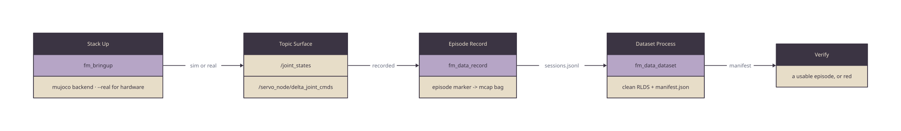

# Onboarding Demo — The Whole Loop On A Bare Laptop

The fastest way to understand what First Motive builds is to run its data path
once, end to end, on the machine in front of you. No robot, no rig, no camera,
no lab booking. A laptop with Docker and this repo gets from nothing to a graded
dataset in **under an hour**, most of it spent waiting on a build.

That path is not a demo mode written for newcomers. It is the same four verbs the
team runs, the same ones the `loop` CI job runs on every push — the sim backend is
simply the default, and hardware is the flag.



Source: [`diagrams/loop.d2`](diagrams/loop.d2).

## Why Sim Is The Default

`fm stack up` brings up the MuJoCo backend unless told otherwise. `--real` swaps
in the hardware backend. Everything above that swap — the controllers, the
`/joint_states` stream, the servo command topics the recorder captures — is
identical, so an episode recorded in sim and an episode recorded on an arm move
through the same recorder, the same processing engine, and the same manifest
contract.

That identity is what makes the demo worth running: you are not learning a
simplified version of the system, you are learning the system with its physics
substituted.

## The Budget

| Step | Time | What you are waiting for |
|------|------|--------------------------|
| Clone + import | ~5 min | `install.sh` clones the package repos and vendors externals |
| Image pull | ~10 min | the published `fm-app` full-stack image |
| `colcon build` | ~20 min | the assembled workspace, once |
| The loop itself | ~2 min | stack up, record, process, verify |

Only the last row repeats. After the first build, running the loop again costs
minutes, which is the point — this is meant to be re-run whenever you want to see
what a change did.

## Run It

```bash
git clone https://github.com/first-motive/fm-ros2 fm_ros2 && cd fm_ros2
./install.sh                              # clone the package repos, vendor externals
./scripts/install/import-externals.sh     # vendor the pinned robot sources
docker compose -f docker/compose.yaml -f docker/compose.macos.yaml \
  run --rm fm ./scripts/run/build.sh
```

On Linux, swap `compose.macos.yaml` for `compose.linux.yaml`.

Then the loop, one verb at a time:

```bash
fm stack up                        # mujoco sim — the same topic surface as hardware
fm stack status                    # assert the surface is complete
fm episode record --duration 10    # start the recorder, record a take, close it
fm dataset process                 # run the fm_data engine over what was recorded
fm dataset verify                  # assert the manifest describes a usable episode
fm stack down                      # the inverse of stack up
```

Nothing drives the arm, so the take carries observations and an idle action
channel. To record something that moves, drive it from a second terminal
(`fm teleop`) while the episode is open.

Or run all of it as one graded script — the same one CI runs:

```bash
docker compose -f docker/compose.yaml -f docker/compose.macos.yaml \
  run --rm fm ./scripts/ci/loop.sh
```

It prints a `PASS`/`FAIL` line per step and exits non-zero if any failed.

## What Each Verb Leaves Behind

| Verb | Artifact | Where |
|------|----------|-------|
| `fm stack up` | a running graph publishing `/joint_states` | the ROS graph |
| `fm episode record` | an MCAP bag plus a line in the episode index | `~/recordings/` |
| `fm dataset process` | `manifest.json` and eligible clean RLDS output | `~/processed/` |
| `fm dataset verify` | a pass/fail verdict on that manifest | stdout, exit code |

## Reading The Verdict

`fm dataset verify` fails in three distinct ways, and the message says which:

- **no manifest** — processing never ran, or never finished
- **zero episodes** — the loop ran and recorded nothing
- **none usable** — episodes were recorded and every one was quarantined or
  dropped, usually because a required stream was missing from the take

An existence check would call the last two a pass. They are the two most common
ways the loop breaks, so the check grades dispositions rather than files.

## Where To Go Next

- [RUN.md](RUN.md) — the `run.sh` front door and the `fm_tui` launcher
- [ARCHITECTURE.md](ARCHITECTURE.md) — what sits behind each verb
- [CI.md](CI.md) — every job, with the exact command to reproduce it locally
