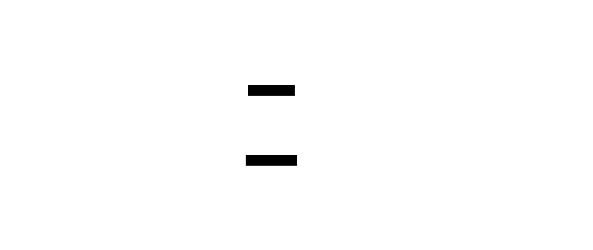

# macOS Setup (M5, OrbStack)

How to build and run `fm-ros2` on an M5 MacBook Pro. This path is dev + build +
sim + dataset only — no GPU, no hardware. Hardware and GPU work happen on Linux.

## Why containers

ROS2 Humble targets Ubuntu. On macOS we run it inside a Linux arm64 container via
OrbStack. The workspace is bind-mounted, so host edits rebuild without reimaging.



Source: [`diagrams/setup.d2`](diagrams/setup.d2).

## Prerequisites

1. Install [OrbStack](https://orbstack.dev) — the Docker provider on M5.
2. Install [Foxglove Studio](https://foxglove.dev/download) (native macOS app).

## First run

```bash
git clone https://github.com/first-motive/fm-ros2.git
cd fm-ros2
vcs import src < fm-ros2.repos     # pull the four public package repos into src/
./scripts/setup-macos.sh
```

`setup-macos.sh` checks OrbStack, imports external deps (placeholder pins), and
builds the base image (arm64). The package source comes from the four public repos
in `fm-ros2.repos` — import them into `src/` first, as shown above.

## Bring the stack up

```bash
docker compose -f docker/compose.yaml -f docker/compose.macos.yaml up
```

Then open Foxglove Studio and connect to `ws://localhost:8765`. Topics appear once
the bringup launch is running.

## Common tasks

Open a shell in the container:

```bash
docker compose -f docker/compose.yaml -f docker/compose.macos.yaml run --rm fm_ros2 bash
```

Build and test (same commands CI runs):

```bash
docker compose -f docker/compose.yaml -f docker/compose.macos.yaml \
  run --rm fm_ros2 ./scripts/verify-build.sh
```

Run the end-to-end smoke check:

```bash
docker compose -f docker/compose.yaml -f docker/compose.macos.yaml \
  run --rm fm_ros2 ./scripts/smoke.sh
```

Launch the graph (foxglove bridge + control):

```bash
# inside the container shell
ros2 launch fm_bringup bringup.launch.py
```

Run the headless MuJoCo sim:

```bash
# inside the container shell
ros2 run fm_sim_core sim_loop
```

## Limits of the macOS path

| Works | Does not work |
|-------|---------------|
| build, colcon test | GPU compute |
| headless MuJoCo (CPU) | robot hardware / `/dev` |
| dataset record / replay | X11 GUI passthrough |
| Foxglove viz over ws | CUDA training |

For GPU, hardware, or GUI tools, use the Linux native path
(`scripts/setup-linux.sh` + `compose.linux.yaml`).

## Troubleshooting

- **`docker info` does not mention OrbStack** — another Docker provider is active.
  Switch to OrbStack so builds use the arm64 path.
- **Foxglove will not connect** — confirm the stack is up and port 8765 is mapped
  (it is, in `compose.macos.yaml`). Check the bridge node is running.
- **`vcs import` fails** — pins in `external.repos` are placeholders. Edit them to
  real tags before importing.
