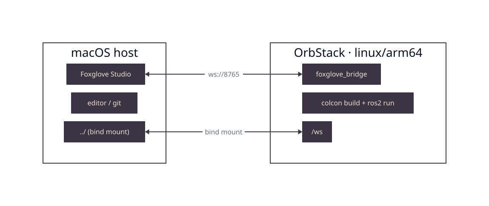

# Setup

How to build and run `fm-ros2`. Two paths share one imported workspace:

| Path | Default on | Runs | Best for |
|------|-----------|------|----------|
| **Native** (pixi + RoboStack) | macOS, Windows | ROS2 Humble on the host, no container | day-to-day dev on a Mac or Windows box |
| **Container** (Docker + compose) | Linux | ROS2 Humble in a Linux arm64 container | CI, parity, Unitree hardware, GPU/Linux work |

`install.sh` picks the path by OS and writes the choice to `.fm_ros2.json`;
`run.sh` reads that file to dispatch. Override with `--native` / `--container`.
Both paths are dev + build + sim + dataset on macOS — no GPU, no hardware. Hardware
and GPU work happen on Linux.

Both paths are also drivable from **First Motive**, the native macOS app
([first-motive/fm-desktop](https://github.com/first-motive/fm-desktop)): it runs
the same `install.sh` and reads and writes the same `.fm_ros2.json` this page
describes, so the app and the command-line paths share one workspace.

## Native Path (Recommended)

On macOS and Windows, the native path runs ROS2 Humble directly on the host through
[pixi](https://pixi.sh) and [RoboStack](https://robostack.github.io) — no container,
no VNC. RoboStack ships prebuilt Humble binaries on the `robostack-humble` conda
channel; `pixi.lock` pins the exact solve for `osx-arm64`, `win-64`, and `linux-64`
from one `pixi.toml`.

```bash
git clone https://github.com/first-motive/fm-ros2.git fm_ros2
cd fm_ros2
./install.sh --native                 # bootstrap pixi, solve the env, install the viewer
./run.sh                              # pixi run build, then the launcher
```

`install.sh --native` bootstraps pixi (pinned via `PIXI_VERSION`), solves the env
from `pixi.lock`, and installs the viewer (Foxglove via Homebrew cask on macOS /
winget on Windows; rviz and none need nothing — rviz ships inside the pixi env).
`run.sh` then runs the `build` task (`pixi run build`) on the host and opens
`fm_tui` natively. rviz2 renders through its native RoboStack build; Foxglove Studio
connects to the in-env bridge at `ws://localhost:8765`.

On macOS (osx-arm64), the full workspace builds natively — all 25 packages, including
the `unitree_*` interface externals and the MoveIt-dependent `fm_control` / `fm_teleop`.
The `build` task passes `-DPython_EXECUTABLE` so `rosidl_generator_py` finds the env
Python; MoveIt and its servo package are added to the env (see `pixi.toml`).

On Windows, use the PowerShell wrappers — they ensure Git for Windows, then delegate
to the same bash path through Git Bash:

```powershell
.\install.ps1 --native      # ensure Git Bash, then run install.sh --native
.\run.ps1                    # dispatch through run.sh (native on Windows)
```

### Caveats

| Caveat | What to do |
|--------|-----------|
| `rosdep` is unsupported inside a pixi env | Add ROS deps with `pixi add ros-humble-<pkg>`, not `rosdep`. When a package fails with "could not find <pkg>", add it to `pixi.toml`. |
| Real Unitree hardware needs Linux SocketCAN | The Unitree message packages build + run natively for sim, but driving a physical Unitree robot still needs the Linux container. |
| macOS `controller_manager` crashes on controller activation (ros2_control [#604](https://github.com/ros-controls/ros2_control/issues/604)) | Handled automatically: `scripts/install/patch-ros2-control-macos.sh` rebuilds the one-line-fixed dylib and swaps it in, and the native build adds `-dead_strip_dylibs` so `rosidl_generator_py` libs aren't over-linked into C++ nodes. Both run on install and self-heal on every `pixi run build`. Restore stock with `mv $CONDA_PREFIX/lib/libcontroller_manager.dylib{.orig,}`. |
| `ros-humble-foxglove-bridge` has no `win-64` build on `robostack-humble` | Native Windows has no Foxglove path — Windows installs default to the rviz viewer. |
| Native Linux is deferred | Linux stays on the container (the CI/parity default). |
| The Windows path (`.ps1` wrappers → Git Bash) is exercised by the `windows-latest` CI job, but not yet on a physical Windows box | Treat Windows as CI-verified; a real-machine pass is still pending. |

### Why pixi

Native ROS2 on macOS and Windows was historically painful; pixi + RoboStack is now
the mainstream answer:

- **OSRF** made pixi the official ROS2 Windows install (Feb 2025) — conda-forge is
  the exclusive binary source. ([announcement](https://discourse.openrobotics.org/t/upcoming-switch-of-windows-installation-to-pixi-conda/41916))
- **prefix.dev** maintains first-class ROS2 support: a
  [ROS2 tutorial](https://pixi.prefix.dev/latest/tutorials/ros2/), a robotics landing
  page, and a ROS build backend.
- **Peer-reviewed:** "Pixi: Unified Software Development and Distribution for Robotics
  and AI" (arXiv [2511.04827](https://arxiv.org/abs/2511.04827), Nov 2025) — lockfile
  reproducibility across `linux-64` / `osx-arm64` / `win-64`.
- **RoboStack** [recommends pixi](https://robostack.github.io/GettingStarted.html)
  over micromamba for new installs.

## Container Path (Parity / CI)

The container path is the CI/parity path and the default on Linux. ROS2 Humble
targets Ubuntu; on macOS it runs inside a Linux arm64 container via OrbStack. The
workspace is bind-mounted, so host edits rebuild without reimaging.



Source: [`diagrams/setup.d2`](diagrams/setup.d2).

## Prerequisites

1. Install [OrbStack](https://orbstack.dev) — the Docker provider on M5. With
   [Homebrew](https://brew.sh) present, `./run.sh` installs and starts it for you
   (delegated to fm-docker's `docker/install.sh`); install it by hand only if you
   skip `run.sh`.
2. Install [Foxglove Studio](https://foxglove.dev/download) (native macOS app).

## First run

```bash
git clone https://github.com/first-motive/fm-ros2.git fm_ros2
cd fm_ros2
vcs import < fm-ros2.repos     # pull the four public package repos into src/
./scripts/install/setup-macos.sh
```

`setup-macos.sh` checks OrbStack, imports external deps (placeholder pins), and
builds the base image (arm64). The package source comes from the four public repos
in `fm-ros2.repos` — import them into `src/` first, as shown above.

### Learning overlay (team members)

The private learning overlay (data engine + policy) imports automatically when you
install through `install.sh`: its auth gate (`gh auth` + org read) detects org
access and the authenticated team-setup step provisions the overlay on top of the
public workspace. No flag is needed — `--no-learning` opts out, `--learning` forces
it and fails loud when no org access is detected. A non-member install skips the
overlay silently and lands a complete public workspace. The public installer names
no private learning repo; members find the manual steps in the private team docs.

## Bring the stack up

```bash
docker compose -f docker/compose.yaml -f docker/compose.macos.yaml up
```

Then open Foxglove Studio and connect to `ws://localhost:8765`. Topics appear once
the bringup launch is running. Linux appliance services persist their endpoint in
`/etc/fm-bridge.env`; use the configured value when a tower keeps the bridge on a
different port (for example, `8766` when Axol owns `8765`).

## Common tasks

Open a shell in the container:

```bash
docker compose -f docker/compose.yaml -f docker/compose.macos.yaml run --rm fm bash
```

Build and test (same commands CI runs):

```bash
docker compose -f docker/compose.yaml -f docker/compose.macos.yaml \
  run --rm fm ./scripts/ci/verify-build.sh
```

Run the end-to-end smoke check:

```bash
docker compose -f docker/compose.yaml -f docker/compose.macos.yaml \
  run --rm fm ./scripts/ci/smoke.sh
```

Launch the graph (foxglove bridge + control):

```bash
# inside the container shell
ros2 launch fm_bringup bringup.launch.py
```

Run the headless MuJoCo sim:

```bash
# inside the container shell
ros2 run fm_sim_core sim_loop
```

## Limits of the macOS path

| Works | Does not work |
|-------|---------------|
| build, colcon test | GPU compute |
| headless MuJoCo (CPU) | robot hardware / `/dev` |
| dataset record / replay | X11 GUI passthrough |
| Foxglove viz over ws | CUDA training |
| USB wrist cameras (native) | wrist cameras in a container (no USB passthrough) |

For GPU, hardware, or GUI tools, use the Linux native path
(`scripts/install/setup-linux.sh` + `compose.linux.yaml`).

## Processor AWS identity (Linux tower)

The processor service uses AWS IAM Roles Anywhere. It does not store an IAM
access key. Supply the reviewed account, Ohio region, profile, trust anchor,
Roles Anywhere profile, role, and data-plane bucket as explicit
`FM_AWS_IDENTITY_*` values before you install the processor service.

```bash
export FM_AWS_IDENTITY_ACCOUNT_ID=624198668504
export FM_AWS_IDENTITY_REGION=us-east-2
# Use the profile selector approved by the installed identity contract.
export FM_AWS_IDENTITY_PROFILE=fmtower-processor
export FM_AWS_IDENTITY_TRUST_ANCHOR_ARN=<reviewed-trust-anchor-arn>
export FM_AWS_IDENTITY_PROFILE_ARN=<reviewed-roles-anywhere-profile-arn>
export FM_AWS_IDENTITY_ROLE_ARN=<reviewed-processor-role-arn>
export FM_AWS_IDENTITY_BUCKET=<reviewed-ohio-bucket>
./install.sh --processor --service
```

The first run creates the tower-local private key and CSR, then exits with code
`3`. Sign that CSR with the offline First Motive CA. Return only the public
certificate and public CA certificate to the tower, set
`FM_AWS_IDENTITY_CERTIFICATE_INPUT` and
`FM_AWS_IDENTITY_CA_CERTIFICATE_INPUT`, and run the same install command again.
The installer verifies the chain, certificate purpose, identity, expiry window,
and key match before it changes the active certificate.

Use these commands for repeatable checks and recovery:

```bash
sudo scripts/install/install-processor-identity.sh check
sudo scripts/install/install-processor-identity.sh receipt
sudo scripts/install/install-processor-identity.sh uninstall
```

`uninstall` removes generated service wiring. It keeps the private key, CSR,
public certificate, and receipt so an interrupted install can resume. The
processor must pass the live caller-identity and allowed/denied AWS probes before
it is ready for a cloud job.

The processor stays local-only unless the Ohio service lane is explicitly enabled.
On a host where the identity bucket is already reviewed, set the opt-in before
the service install:

```bash
export FM_AWS_INFERENCE_SERVICE_MODE=1
export FM_AWS_INFERENCE_BUCKET="$FM_AWS_IDENTITY_BUCKET"
export FM_AWS_INFERENCE_READINESS_DIR=~/fm-data-runs/aws-readiness
./scripts/install/install-processor-service.sh
```

The installer requires the installed identity profile to pass its read-only
check, then derives that profile and the Ohio region before it writes the
non-secret selectors atomically to `/etc/fm-processor-aws.env`. It refuses
conflicting existing settings and never creates readiness receipts. The
read-only AWS preflight must supply fresh, profile-bound `qwen2.5.json` and
`qwen3.5.json` receipts in that directory; missing or stale receipts keep both
lanes offline. The managed file remains active on a later service reinstall when
the mode variable is not exported, so an ordinary reinstall cannot silently
disable the route. To disable the route, stop the service and remove that
managed file after review (or run the installer's `uninstall`, which removes all
managed service files), then install again with the mode unset. The service
wrapper resolves the nested `src/fm_data` source commit before launch and keeps it
in the annotation evidence.

## Wrist cameras (capture rig)

The studio capture rig uses two USB RGB wrist cameras, driven by the
`fm_data_sensors` package. Data Capture brings them up automatically;
`ros2 launch fm_data_sensors cameras.launch.py` runs them standalone.

- **Driver by platform.** robostack osx-arm64 ships no generic USB camera driver, so
  the native macOS path builds `opencv_cam` (OpenCV VideoCapture over AVFoundation)
  from source — it is vendored in `external.repos` and built by
  `import-externals.sh` only on macOS. Linux uses the `usb_cam` binary instead.
  `cameras.launch.py` picks the driver by ament index, so the same launch works on
  both. Container-on-mac has no wrist cameras: OrbStack passes no USB through, so
  capture is a native-mac path only.
- **Device index.** `config/wrist_cameras.yaml` sets each camera's `device` index.
  macOS Continuity Camera can claim index 0 and shuffle the USB cameras, so the left
  and right streams may come out swapped — check `ros2 topic hz` and swap the indices
  in the yaml if so. Override the whole file with `config:=/path/to.yaml`.
- **Resolution.** Default is 1280x720 at 30 fps; full 8MP raw is ~24 MB/frame, which
  kills DDS and bag size. Recording captures the compressed stream; the raw stream
  stays on-host for the viewer.
- **Calibration is deferred.** Cameras run uncalibrated by default (placeholder `.ini`
  files ship in the package). Set `calibration_url` in the yaml once intrinsics land.

## Troubleshooting

- **`docker info` does not mention OrbStack** — another Docker provider is active.
  Switch to OrbStack so builds use the arm64 path.
- **Foxglove will not connect** — confirm the stack is up and the configured bridge
  port is mapped (the local compose default is 8765). On a Linux appliance, read
  `/etc/fm-bridge.env` and run `python3 scripts/internal/bridge-probe.py`; then
  check the owning systemd service.
- **`vcs import` fails** — pins in `external.repos` are placeholders. Edit them to
  real tags before importing.
